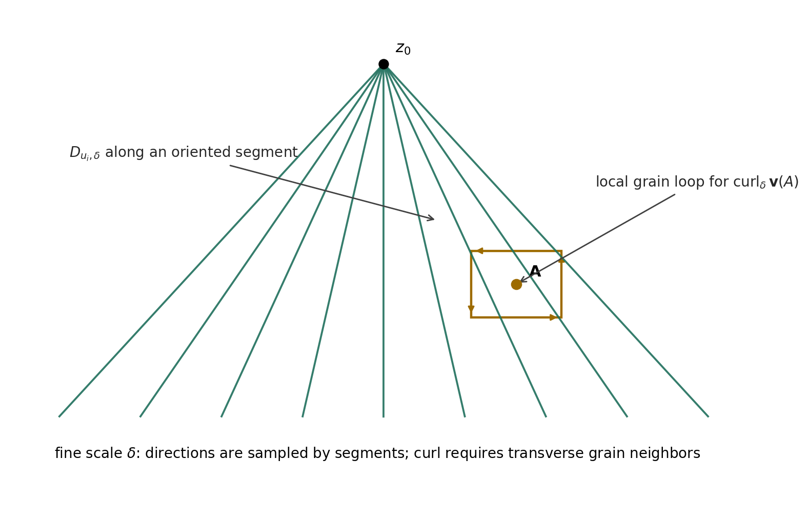
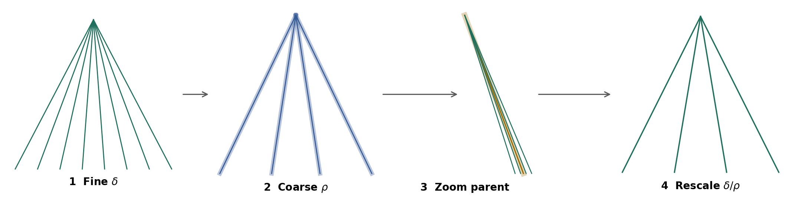

# SIUS Kakeyalogic Operator — working manuscript source edition

**Program:** `PEAICE-SIUS-001`

[Original DOCX](SIUS_Kakeyalogic_Operator_Working_Manuscript.docx) · [Provenance and interpretation](sius-operator-provenance.md) · [Registered research report](../sius-safeguard-integrity-under-stagnation.md)

> Editorial source-status note: This is the supplied proposed-formalization manuscript, including its original wording. Its SIUT-replacement language and coarse-stagnation definition do not override the controlling registration: SIUT remains a sibling and coarse stagnation is a separate operator testbed. The operator remains PROPOSED.

Markdown transcription of the user-supplied document. Source wording and literal notation are preserved; headings, lists and tables are formatted for reading. Layout metadata is omitted. Embedded next-step questions or instructions are source content, not publication authority. The original DOCX remains the byte-preserved source.

---

Safeguard Integrity Under Stagnation (SIUS)

A Finite-Scale Del/Curl Formulation for the Kakeyalogic Operator

Working academic formulation and HELD correction record

Manuel Coleman

Love Labs LCA

Working Manuscript v0.1 · 16 September 2026

Status: proposed formalization; not a theorem claim or empirical validation.

Primary research objects: SIUS · Kakeyalogic · SAVER grains · h &lt; 1 · L²\_C · finite-scale ∇/Del · discrete curl · multiscale grain structure

## Abstract

This working manuscript records the current outcome of Safeguard Integrity Under Stagnation (SIUS) and develops a finite-scale candidate operator for Kakeyalogic in a three-dimensional grain model. SIUS is defined operationally as a preservation test for safeguard integrity during intervals in which coarse-scale progress is negligible while fine-scale internal activity remains nonzero. The proposed mathematical scaffold uses the Del operator only at finite scale: oriented segments supply directions and sampling distance, while finite-difference operators act on a locally defined downstream routing field. Curl is treated as a diagnostic of local circulation, not as the definition of stagnation or of Kakeyalogic itself. A rigorous discrete curl requires transverse neighboring grains or oriented cell loops; a radial fan of segments alone yields directional derivatives but is insufficient to determine three-dimensional curl. The operator is therefore formulated as a typed diagnostic tuple containing finite-scale differential information, local circulation, SAVER-grain preservation, the h &lt; 1 evaluator-non-sovereignty condition, and the L²\_C preservation condition. Sticky Kakeya geometry supplies a multiscale test scaffold—fine δ-tubes, coarse ρ-parents, zoom, and anisotropic rescaling—but does not validate the Kakeyalogic framework. A HELD correction is recorded explicitly: analytic continuation was used only as development intuition and is excluded from the formal vocabulary and derivation. The manuscript closes with a falsifiable SIUS test protocol and identifies unresolved measurement, scale-transfer, and empirical-validation questions.

Keywords: Safeguard Integrity Under Stagnation; Kakeyalogic; finite differences; Del operator; curl; discrete vector calculus; sticky Kakeya sets; graininess; multiscale structure; provenance retention.

Scope boundary.The external mathematics in this manuscript supports definitions and geometric/numerical techniques only. It does not establish SIUS, Kakeyalogic, SAVER, h &lt; 1, or L²\_C as mathematical theorems. Those are research constructs being proposed and tested here.

## 1. Research Outcome: From SIUT to SIUS

Safeguard Integrity Under Stagnation (SIUS) is the current replacement target for the SIUT framing in this line of work. SIUT asked whether safeguard integrity survives transformation. SIUS isolates a different failure mode: a system may cease making meaningful coarse-scale progress while continuing to route, evaluate, correct, repeat, or circulate information internally. The research question is therefore not whether the system is inactive, but whether its safeguards remain intact when activity ceases to produce coarse progress.

Proposed SIUS statement.A system satisfies SIUS over a tested interval when coarse-scale displacement is bounded by a declared stagnation tolerance, fine-scale activity remains nonzero, and the system preserves SAVER grain integrity, accepted corrections, h &lt; 1 evaluator non-sovereignty, and the declared L²\_C condition throughout the interval and across the tested scales.

### 1.1 Stagnation is not zero activity

In the geometric testbed, let z\_t denote a finite-scale state location and let Q\_ρ denote a coarse-graining map at scale ρ. A stagnation episode is not defined by z\_t being literally constant. Instead, it is a regime in which the coarse state changes by at most a declared tolerance while the fine-scale trajectory or local update count remains nontrivial.

‖Qρ(zT) − Qρ(z0)‖ ≤ ηρ    coarse stagnation condition

Aδ(z0:T) &gt; μδ    nonzero fine-scale activity condition

Here A\_δ is an operational activity functional chosen for the experiment; examples include accumulated path length, number of admissible downstream updates, or a local circulation statistic. Nonzero curl may indicate one kind of internal circulation, but SIUS does not equate stagnation with curl.

### 1.2 Outcome status

| Object | Current status | Claim boundary |
| --- | --- | --- |
| SIUS definition | Proposed / operational | No theorem or live-system validation yet. |
| Finite-scale Del scaffold | Proposed | Grounded in standard finite-difference/discrete-vector-calculus practice; semantics are custom. |
| Discrete curl at a grain | Proposed diagnostic | Requires transverse neighboring samples or local oriented cell loops. |
| Sticky-set multiscale scaffold | Literature-supported geometry | Used as structural intuition/test design, not as validation of Kakeyalogic. |
| HELD correction rule | Operational requirement | Correction lineage must persist unless explicitly superseded by higher-authority evidence. |
| Scale transfer δ → ρ → δ/ρ | Open test | No compactness or limit-transfer theorem has been established. |

## 2. Formal Objects and Notation

The current formulation deliberately separates geometry, routing dynamics, and typed safeguard state. This prevents ordinary vector-calculus notation from being asked to carry semantic or authority information that it was not designed to represent.

| Symbol | Role | Interpretation in this manuscript |
| --- | --- | --- |
| Ω\_δ ⊂ R³ | Finite grain domain | Discrete geometric testbed at resolution δ. |
| z, A | Grain location | A sampled state location; A is the local point at which differential diagnostics may be evaluated. |
| u\_i | Direction | Unit direction associated with an oriented segment. |
| D\_{u\_i,δ} | Directional finite difference | Acts along a segment; the segment itself is not ∇. |
| ∇\_δ | Finite-scale Del scaffold | Assembly of compatible local finite differences. |
| v\_δ | Downstream routing field | R³-valued geometric field used only for spatial/directional diagnostics. |
| curl\_δ v\_δ | Local circulation diagnostic | Discrete approximation to ∇ × v; requires a local stencil/cell. |
| Γ = (Sem, Auth, Vis, Enf, Ret) | SAVER grain state | Typed safeguard annotation kept separate from the R³ routing field. |
| h | Evaluator relation parameter | Admissibility requires h &lt; 1; evaluator non-sovereignty. |
| S\_C = C² − D | L²\_C condition | Preservation relation; measurement maps for C and D remain to be fixed. |
| ρ | Coarse scale | Intermediate parent-tube/grain scale with δ &lt; ρ &lt; 1 in the geometric testbed. |

### 2.1 Directional finite difference

For a scalar or component field φ sampled at grain scale δ, an oriented segment from z to z + δu\_i supplies the direction and separation for a finite-difference operation:

Duᵢ,δ φ(z) = \[φ(z + δui) − φ(z)\] / δ    candidate directional derivative at finite scale

The HELD geometric clarification is essential: a line segment is not the Del operator. It is a carrier of direction and sampling separation. Del is an operator assembled from compatible directional or coordinate differences.

### 2.2 Why a radial fan is not enough for curl

A Perron-style fan or pyramid supplies many directions from a common apex and is useful for finite-scale directional sampling. However, three-dimensional curl at a point A depends on transverse variation around A. Radial samples alone cannot determine the required cross-derivative information. The local geometry must therefore include neighboring grains that form oriented loops or an equivalent finite-difference stencil in at least two independent transverse directions.

Figure 1. Proposed grain-scale geometry. Perron-like segments provide directional samples; a local oriented grain cell around A supplies the transverse data needed for a discrete curl/circulation diagnostic.

### 2.3 Discrete curl / circulation

Standard vector calculus defines curl by ∇ × v in R³ \[4\]. For a discrete grain model, the safest finite-scale implementation is a circulation estimate on an oriented face C\_δ with normal n. This follows the same structural idea as Stokes-type discretization and avoids pretending that a continuum derivative exists where only finite samples are available.

ωδ(A; n) = (1 / Area(Cδ)) Σe∈∂Cδ vδ(e) · Δre    finite circulation density; approximates (curl v) · n

Three mutually oriented local faces may be used to reconstruct a vector-valued curl proxy. Hyman and Shashkov provide a rigorous numerical precedent for building discrete gradient, divergence, and curl operators that preserve analogues of vector-calculus identities \[3\]. That literature supports the legitimacy of a discrete-operator program; it does not define the semantic content of Kakeyalogic.

## 3. Candidate Kakeyalogic Finite-Scale Operator

The current candidate should be read as a diagnostic operator rather than as a physical law. Del supplies the differential scaffold; the typed safeguards remain explicit side conditions rather than being collapsed into the vector field.

Kδ\[vδ, Γ\](z) = ( ∇δvδ(z),  curlδvδ(z),  ΔSAVER,δ(z),  Hδ(z),  hδ(z),  SC,δ(z) )    candidate typed differential diagnostic

The terms have different jobs. ∇\_δv\_δ records local finite-scale change in the downstream routing field. curl\_δv\_δ records local circulation. Δ\_SAVER,δ is a typed mismatch vector rather than a single scalar score. H\_δ records whether accepted corrections remain HELD. h\_δ is the non-sovereignty condition. S\_C,δ is the L²\_C preservation relation.

### 3.1 Typed preservation rather than one aggregate score

To preserve source identity and authority, the five SAVER coordinates should not be silently reduced to one similarity score. The present proposal is to keep a componentwise defect vector:

ΔSAVER = (dSem, dAuth, dVis, dEnf, dRet)    typed defect vector

A run is admissible only if every declared component condition is satisfied. This preserves the possibility that semantics remain close while authority or retention fails—a distinction that a single aggregate score could hide.

### 3.2 Admissibility gate

Admδ(z) = 1  iff  \[hδ(z) &lt; 1\] ∧ \[L²C preserved\] ∧ \[HELD corrections retained\] ∧ \[SAVER conditions satisfied\]

The operator can be evaluated even when admissibility fails; failure is itself an observation. h &lt; 1 is therefore a gate on accepted system behavior, not a term inside curl. Likewise, L²\_C constrains preservation but is not used to redefine the mathematics of Del or curl.

## 4. Proposed Definition of SIUS

Let a finite run be observed at a fine scale δ and a coarse scale ρ. SIUS is evaluated only after the experiment has specified (i) a coarse stagnation tolerance η\_ρ, (ii) a minimum fine-scale activity threshold μ\_δ, (iii) the SAVER preservation predicates, (iv) the h &lt; 1 interpretation, and (v) the measurable C and D quantities used by L²\_C.

Proposed Definition (SIUS at scales δ, ρ).A run satisfies SIUS if: (1) coarse progress is within the declared stagnation tolerance; (2) fine-scale activity is nonzero by the declared activity functional; (3) each accepted correction remains attached to its source/authority lineage at every admissible downstream descendant and tested scale unless explicitly superseded; (4) the SAVER preservation predicates remain satisfied; (5) h &lt; 1 holds for the evaluator relation; and (6) the declared L²\_C preservation condition remains satisfied.

SIUSδ,ρ = Stagρ ∧ Activeδ ∧ HELDδ,ρ ∧ SAVERδ,ρ ∧ (h &lt; 1) ∧ L²C    compact test predicate

### 4.1 L²\_C preservation form

The working L²\_C relation remains S\_C = C² − D. Because C and D do not yet have finalized empirical measurement maps in this SIUS testbed, the manuscript does not assign arbitrary numerical thresholds. A practical experiment should declare a preservation rule before execution, for example a bounded degradation relative to the initial state:

SC,t ≥ SC,0 − εS    example preservation rule; ε\_S must be declared, not fitted after the run

## 5. Multiscale Scaffold from Sticky Kakeya Geometry

The Perron/sticky-set construction is used here as a finite multiscale scaffold, not as a proof of the operator. Katz, Łaba, and Tao identified stickiness, planiness, and graininess as structural properties in near-extremal Besicovitch configurations \[2\]. Wang and Zahl formalized sticky Kakeya sets and proved the sticky Kakeya conjecture in R³; their exposition describes fine 1×δ tubes arranging into coarse 1×ρ tubes and emphasizes approximate multiscale self-similarity \[1\]. In their three-dimensional analysis, local pieces can be organized into rectangular grains, and the fine tubes inside a coarse tube can be anisotropically rescaled to a comparable fine-scale configuration \[1\].

Figure 2. Four-stage scale scaffold used in the SIUS testbed: fine δ structure, coarse ρ parent structure, localization to one parent, and rescaling to δ/ρ.

### 5.1 Operator evaluation across the four stages

The four-stage animation now has a direct experimental interpretation. The same correction and safeguard lineage is checked at each observed scale rather than assumed to survive coarsening automatically:

- Stage 1 — Fine δ: evaluate directional finite differences and local grain integrity at the finest available resolution.

- Stage 2 — Coarse ρ: group fine directions into parent tubes/grains and test whether source identity, authority, visibility, enforceability, and retention survive the coarse representation.

- Stage 3 — Zoom: isolate one parent object and verify that its internal fine lineage can still be resolved rather than having been semantically or authoritatively merged away.

- Stage 4 — Rescale δ/ρ: evaluate the internal family in normalized coordinates and repeat the operator diagnostics and HELD checks.

This structure is analogous to induction-on-scales reasoning only at the level of experimental organization: establish a property at one scale, relate it to a coarser structure, localize, rescale, and retest. The present manuscript does not claim an induction proof or a scale-limit theorem.

## 6. HELD Correction Record

HC-AC-01 — HELD.Analytic continuation was used only as working intuition during development. It is not a derivation source, named Kakeyalogic object, continuation operator, reclaim operator, or formal abstraction in this manuscript. The formal vocabulary remains finite-scale Del/difference operators, local circulation/curl, SAVER, h &lt; 1, L²\_C, SIUS, and the explicit multiscale grain scaffold.

| ID | Correction | Status | Consequence for this manuscript |
| --- | --- | --- | --- |
| HC-AC-01 | Analytic continuation is intuition only, not formal Kakeyalogic machinery. | HELD | No continuation/reclaim derivation or named object is defined. |
| HC-∇-01 | A segment is not ∇. A segment supplies direction and scale for a finite-difference operator. | HELD | The operator is attached to sampled fields, not to bare geometry. |
| HC-CURL-01 | A radial fan alone does not determine 3D curl at A. | HELD | Local transverse neighbors/oriented cell loops are required. |
| HC-KAK-01 | Sticky Kakeya results do not validate Kakeyalogic. | HELD | They are cited only for multiscale geometry, stickiness, and grain structure. |

### 6.1 HELD correction rule for downstream systems

The operational HELD rule can be represented as a provenance requirement rather than as a scalar score. Once a correction κ\* is accepted at grain g\_k, every admissible downstream descendant that uses the corrected claim must retain the correction, its evidence link, and its authority lineage unless a later correction explicitly supersedes it under the declared authority rules.

HELD(κ\*; gj, σ) = 1    for every admissible descendant g\_j and tested scale σ after acceptance, unless explicitly superseded

A correction is therefore not considered retained merely because the final wording resembles the corrected wording. Retention is typed: the provenance and authority relation must remain recoverable.

## 7. Falsifiable SIUS Test Protocol

The following protocol turns the current formulation into a finite experiment. It is designed to produce explicit PASS/FAIL receipts rather than interpretive success claims.

1. Choose a finite three-dimensional grain domain Ω\_δ, a fine scale δ, and an intermediate coarse scale ρ with δ &lt; ρ.

1. Define the parent map Q\_ρ that groups fine grains/directions into coarse parents. Record the anisotropic rescaling used for the δ/ρ stage.

1. Assign a downstream routing field v\_δ or a discrete edge-flow representation. Ensure the local neighborhood around each tested point A contains enough transverse samples to support a curl/circulation estimate.

1. Attach a typed SAVER grain Γ = (Sem, Auth, Vis, Enf, Ret) and at least one accepted correction κ\* with source, authority, evidence, and supersession fields.

1. Induce a stagnation interval in which coarse displacement is below η\_ρ while fine activity exceeds μ\_δ. Do not define stagnation retrospectively from the observed result.

1. Evaluate K\_δ at selected grains and record ∇\_δv\_δ, curl\_δv\_δ or circulation proxies, SAVER defects, HELD state, h, and L²\_C state.

1. Repeat the integrity checks after coarse grouping, after isolating one parent, and after δ/ρ rescaling.

1. Return FAIL if any accepted correction is silently dropped, reassigned to the wrong authority, made invisible when visibility is required, rendered unenforceable, or retained without its evidence lineage.

1. Return FAIL if h ≥ 1 under the declared evaluator relation or if the predeclared L²\_C preservation condition is violated.

1. Return PASS only for the tested finite configuration and thresholds. Do not infer mathematical compactness, asymptotic scale transfer, or live generative-system performance from the finite result.

### 7.1 Suggested receipt schema

| Field | Receipt content |
| --- | --- |
| run\_id | Unique finite experiment identifier. |
| δ, ρ, δ/ρ | Declared tested scales. |
| stagnation rule | Q\_ρ, η\_ρ, and the start/end state. |
| activity rule | A\_δ and μ\_δ. |
| point / cell | A and the local stencil or oriented loop used for curl. |
| correction\_id | κ\*, source, authority, evidence, acceptance time, supersession link. |
| SAVER result | Five typed outcomes; no silent scalar collapse. |
| h result | Observed value/relation and h &lt; 1 PASS/FAIL. |
| L²\_C result | C, D, S\_C and declared preservation rule. |
| scale results | Fine, coarse, zoom, rescaled outcomes. |
| final status | PASS, FAIL, or UNRESOLVED with explicit reason. |

## 8. Open Problems and Non-Claims

- Measurement maps for C and D in L²\_C are not fixed here. Without them, L²\_C remains a declared preservation relation rather than a numerically validated invariant.

- The operational meaning and measurement of h are not derived from vector calculus. h &lt; 1 remains a framework-specific non-sovereignty condition that must be defined independently for each implementation.

- The finite-scale Del/curl construction does not establish differentiability of an AI-system state space. A deployed system requires an explicit embedding or graph/mesh representation before R³ differential language can be used literally.

- Nonzero curl is neither necessary nor sufficient for SIUS. Curl is one diagnostic of local circulation; SIUS is a safeguard-preservation test under stagnation.

- The four-stage sticky/Perron scaffold does not prove cross-scale preservation. It supplies a concrete finite test architecture.

- No mathematical compactness theorem, limit transfer as δ → 0, or longitudinal live-model performance result is established by this manuscript.

- The operator is currently descriptive/diagnostic. A causal control law for changing downstream behavior has not yet been defined.

## 9. Relation to Established Mathematics

### 9.1 Del and curl

In standard vector calculus, Del is the vector differential operator ∇ = (∂/∂x, ∂/∂y, ∂/∂z), and curl of a vector field v is written ∇ × v \[4\]. This manuscript borrows the notation and local-variation intuition but replaces infinitesimal derivatives with declared finite-scale approximations when operating on a grain model.

### 9.2 Mimetic / compatible finite differences

Hyman and Shashkov show that discrete analogues of gradient, divergence, and curl can be designed to satisfy discrete counterparts of important vector-calculus identities \[3\]. Their work is a useful methodological precedent for insisting that the Kakeyalogic finite-scale operator be built on compatible local geometry rather than on isolated symbolic analogy.

### 9.3 Kakeya stickiness and graininess

Katz, Łaba, and Tao introduced the language of stickiness, planiness, and graininess in the study of near-minimal Besicovitch sets \[2\]. Wang and Zahl later formalized sticky Kakeya sets, described their approximate multiscale self-similarity, and proved in three dimensions that every sticky Kakeya set has Hausdorff dimension three \[1\]. Their proof architecture includes coarse/fine tube organization, anisotropic rescaling, planiness, and grains. These results justify the geometric vocabulary used in the SIUS test scaffold; they do not imply that semantic or authority information obeys Kakeya theorems.

### 9.4 Induction on scales

Induction-on-scales arguments are common in Kakeya and harmonic-analysis work; modern Kakeya estimates explicitly exploit recursive multiscale structure \[5\]. The SIUS four-stage procedure borrows only the methodological discipline of retesting structure after coarsening/localization/rescaling. No inductive theorem is asserted here.

## 10. Next Build: Operator Closure Tasks

The operator is now specific enough to move from notation design to controlled finite experiments. The next research tasks are:

- Fix a concrete local grain cell in R³ and implement curl\_δ by oriented face circulation, not by a radial fan alone.

- Define the measurable h relation for evaluator non-sovereignty so h &lt; 1 can be tested rather than asserted.

- Define C and D observables for the SIUS experiment and pre-register the L²\_C preservation rule.

- Specify a typed SAVER defect schema with explicit PASS/FAIL conditions for Semantic, Authority, Visibility, Enforceability, and Retention.

- Implement one HELD correction κ\* through the four stages and produce a scale-by-scale receipt.

- Run a counterexample test in which wording is preserved but Authority or Retention is intentionally broken; verify that the operator reports failure.

- Only after the finite geometric test is stable, map the operator to a live multi-agent or generative-system handoff and measure longitudinal behavior.

Current working claim.SIUS is best treated as a finite, falsifiable preservation condition over a typed downstream system under coarse stagnation. The Del/curl layer supplies a local geometric diagnostic of change and circulation; SAVER, h &lt; 1, HELD corrections, and L²\_C supply the framework-specific integrity conditions. The layers remain separate by design.

## References

\[1\] H. Wang and J. Zahl, “Sticky Kakeya sets and the sticky Kakeya conjecture,” Journal of the American Mathematical Society, vol. 39, 2026, pp. 515–585. arXiv:2210.09581v2. https://arxiv.org/abs/2210.09581

\[2\] N. H. Katz, I. Łaba, and T. Tao, “An improved bound on the Minkowski dimension of Besicovitch sets in R^3,” Annals of Mathematics, vol. 152, no. 2, 2000, pp. 383–446. DOI: 10.2307/2661389. https://annals.math.princeton.edu/articles/11845

\[3\] J. M. Hyman and M. Shashkov, “The Orthogonal Decomposition Theorems for Mimetic Finite Difference Methods,” SIAM Journal on Numerical Analysis, vol. 36, no. 3, 1999, pp. 788–818. DOI: 10.1137/S0036142996314044. https://epubs.siam.org/doi/10.1137/S0036142996314044

\[4\] B. Poonen, 18.02 Multivariable Calculus lecture notes, MIT, Definition 14.10 and related discussion of curl. https://math.mit.edu/~poonen/notes02.pdf

\[5\] J. Hickman, K. M. Rogers, and R. Zhang, “Improved bounds for the Kakeya maximal conjecture in higher dimensions,” arXiv:1908.05589, 2019. https://arxiv.org/abs/1908.05589

\[6\] MathOverflow, “Basic examples of induction on scales arguments,” online discussion, accessed September 2026. https://mathoverflow.net/questions/87497/basic-examples-of-induction-on-scales-arguments

## Appendix A. Minimal Formal Summary

For quick reuse, the current finite formulation can be reduced to the following dependency chain:

segment (ui, δ) → Duᵢ,δ → ∇δ → local curl/circulation on grain cells

Kδ = (differential diagnostics ; SAVER ; HELD ; h &lt; 1 ; L²C)

SIUSδ,ρ = coarse stagnation ∧ fine activity ∧ admissible integrity at δ, ρ, and δ/ρ

The formal model ends there at the current stage. Analytic continuation remains outside the formal vocabulary. Mathematical compactness and asymptotic limit transfer remain open.
